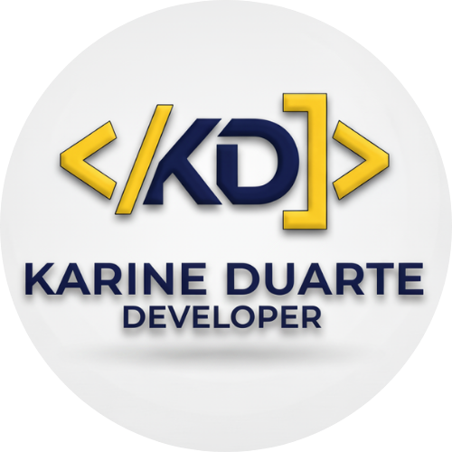

# Portfólio Karine Duarte - Desenvolvedora Full-Stack e Analista de Dados



Este é o repositório do meu portfólio pessoal, desenvolvido para apresentar as minhas competências, experiência e projetos na área de desenvolvimento Full-Stack e análise de dados.

**Visita o site:** [https://site-karine-duarte-developer.vercel.app/](https://site-karine-duarte-developer.vercel.app/) (Substitui, se necessário, pelo URL final do deploy)

---

## ✨ Funcionalidades Principais

* **Secção Hero:** Apresentação dinâmica com animação de digitação.
* **Sobre Mim:** Descrição detalhada das minhas competências e experiência, com opção de download do CV.
* **Minha Jornada:** Timeline interativa apresentando a minha trajetória académica e profissional.
* **Projetos:** Galeria de projetos com descrição, tecnologias utilizadas e links para GitHub e demonstrações (quando aplicável).
* **Momentos da Carreira:** Galeria de imagens com efeito de scroll infinito, destacando participações em eventos e palestras.
* **Blog:** Secção para partilhar artigos e conhecimentos (atualmente com exemplos estáticos).
* **Formulário de Contacto:** Permite aos visitantes enviar mensagens diretamente, com integração com o Supabase.
* **Modal de Contacto:** Pop-up para captação de leads, também integrado com o Supabase.
* **Botão WhatsApp:** Acesso rápido para contacto via WhatsApp.
* **Design Responsivo:** Adaptado para diferentes tamanhos de ecrã.
* **Animações:** Utilização da biblioteca Framer Motion para animações suaves.
* **Vercel Speed Insights:** Monitorização da performance do site.

---

## 🚀 Tecnologias Utilizadas

* **Framework:** [Next.js](https://nextjs.org/) (com App Router e Turbopack)
* **Linguagem:** [TypeScript](https://www.typescriptlang.org/)
* **Biblioteca UI:** [React](https://reactjs.org/)
* **Estilização:** [Tailwind CSS](https://tailwindcss.com/)
* **Animações:** [Framer Motion](https://www.framer.com/motion/)
* **Backend (Formulários):** [Supabase](https://supabase.io/)
* **Ícones:** [React Icons](https://react-icons.github.io/react-icons/)
* **Animação de Texto:** [React Type Animation](https://www.npmjs.com/package/react-type-animation)
* **Fontes:** [Google Fonts (Roboto e Montserrat)](https://fonts.google.com/) via `next/font`
* **Linting:** [ESLint](https://eslint.org/)
* **Analytics:** [Vercel Speed Insights](https://vercel.com/docs/speed-insights)

---

## ⚙️ Como Começar

Para executar este projeto localmente, segue estes passos:

1.  **Clona o repositório:**
    ```bash
    git clone [https://github.com/KarineDuarte15/Site-Karine-Duarte-Developer.git](https://github.com/KarineDuarte15/Site-Karine-Duarte-Developer.git)
    cd Site-Karine-Duarte-Developer
    ```

2.  **Instala as dependências:**
    ```bash
    npm install
    # ou
    yarn install
    # ou
    pnpm install
    # ou
    bun install
    ```

3.  **Configura as Variáveis de Ambiente:**
    * Cria um ficheiro chamado `.env.local` na raiz do projeto.
    * Adiciona as tuas credenciais do Supabase (necessárias para os formulários de contacto):
        ```plaintext
        NEXT_PUBLIC_SUPABASE_URL=A_TUA_URL_SUPABASE
        NEXT_PUBLIC_SUPABASE_ANON_KEY=A_TUA_CHAVE_ANON_SUPABASE
        ```
    * Podes encontrar estas credenciais no painel do teu projeto Supabase em `Project Settings` > `API`.

4.  **Executa o servidor de desenvolvimento:**
    ```bash
    npm run dev
    # or
    yarn dev
    # or
    pnpm dev
    # or
    bun dev
    ```

5.  Abre [http://localhost:3000](http://localhost:3000) no teu navegador para ver o resultado.

---

## 🚀 Deployment

Este site está otimizado para deployment na [Vercel Platform](https://vercel.com/), dos criadores do Next.js.

Consulta a [documentação de deployment do Next.js](https://nextjs.org/docs/app/building-your-application/deploying) para mais detalhes. Não te esqueças de configurar as variáveis de ambiente do Supabase nas definições do teu projeto Vercel.

---

## ⚖️ Licença e Direitos Autorais

**Aviso Explícito:** Adicionar o texto ao README.md torna explícita a tua intenção de reservar os direitos sobre a identidade visual, desencorajando cópias e deixando clara a tua posição.

O código-fonte deste projeto está disponível para consulta e aprendizado. No entanto, a identidade visual do site, incluindo, mas não se limitando ao logótipo, esquema de cores, layout, tipografia e imagens de perfil/eventos, são propriedade intelectual de Karine Duarte e **não podem ser copiados ou reproduzidos** sem permissão explícita.

Copyright © 2025 Karine Duarte. Todos os direitos reservados.

---

## 📬 Contacto

* **GitHub:** [KarineDuarte15](https://github.com/KarineDuarte15)
* **LinkedIn:** [Karine Duarte](https://www.linkedin.com/in/karine-duarte-759ba02bb-)

---
